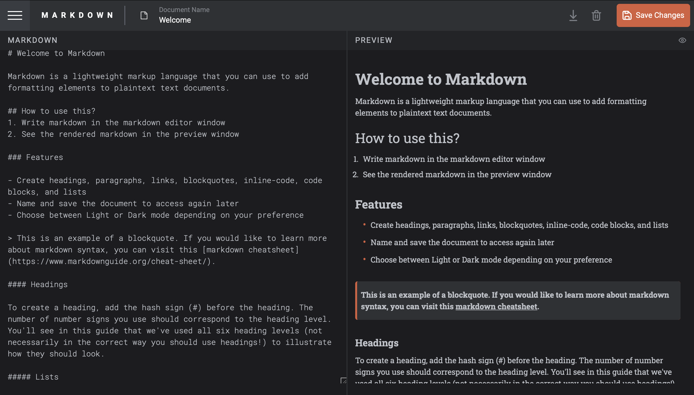

## In-browser markdown editor solution

This is a solution to the In-browser markdown editor 

## Table of contents

- Overview
  - The challenge
  - Screenshot
  - Links
- My process
  - Built with
  - What I learned
  - Continued development
  - Useful resources
- Author

## Overview

### The challenge

Users should be able to:

- Create, Read, Update, and Delete markdown documents
- Name and save documents to be accessed as needed
- Edit the markdown of a document and see the formatted preview of the content
- View a full-page preview of the formatted content
- View the optimal layout for the app depending on their device's screen size
- See hover states for all interactive elements on the page
- Bonus: If you're building a purely front-end project, use localStorage to save the current state in the browser that persists when the browser is refreshed
- Bonus: Build this project as a full-stack application

### Screenshot

### Links

- Solution URL: [Add solution URL here](https://your-solution-url.com)
- Live Site URL: (https://in-browser-markdown-editor-xwi8-jmockd6gd-charles298s-projects.vercel.app)

## My process

### Built with

- HTML,Javascript,CSS
- Tailwindcss
- Redux
- [React](https://reactjs.org/) - TS library
-  [Vite] - React framework
- [Styled Components](https://styled-components.com/) - For styles

### What I learned

- Components: I learned how to break down your UI into reusable components, each managing its own state and lifecycle.
- Markdown Parsing: Integrating libraries like marked or remark to parse Markdown text into HTML.
- CSS Modules/Styled Components: Using modern CSS solutions to style your components and ensure the editor looks good.
- Responsive Design: Making sure the editor works well on different screen sizes.

### Continued development

I will develop on my skill to become better

### Useful resources

- (https://www.youtube.com) - This helped me access to comprehensive tutorials and courses on React, covering everything from basic concepts to advanced techniques.
- (https://www.github.com) - This helped me exploring and learning from existing open-source Markdown editors or React projects.

## Author

### CHARLES AKASOMA

- Frontend Mentor - [@yourusername](https://www.frontendmentor.io/profile/yourusername)

